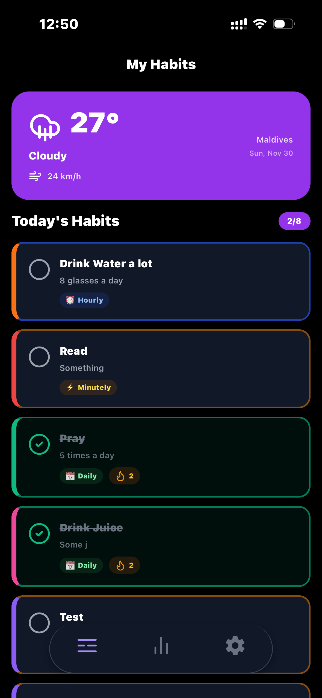
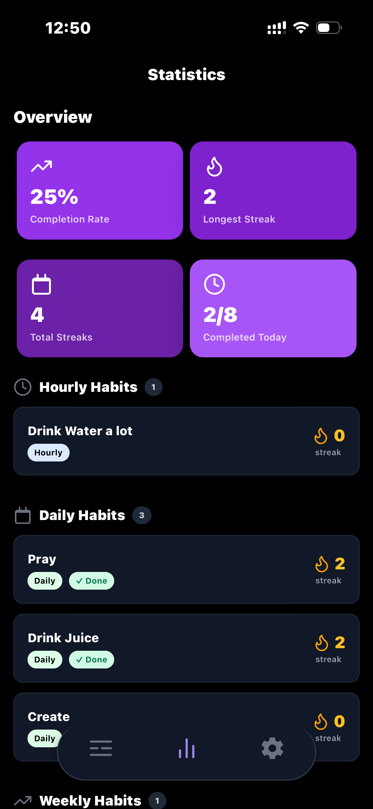
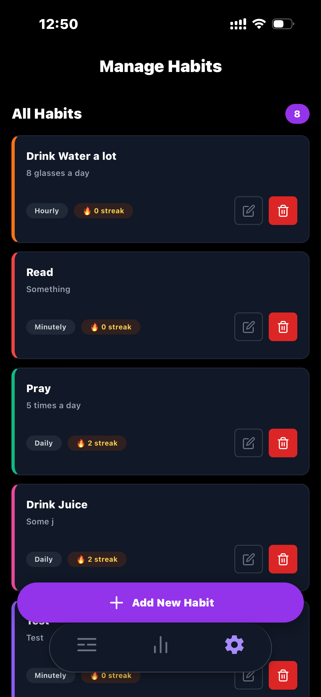
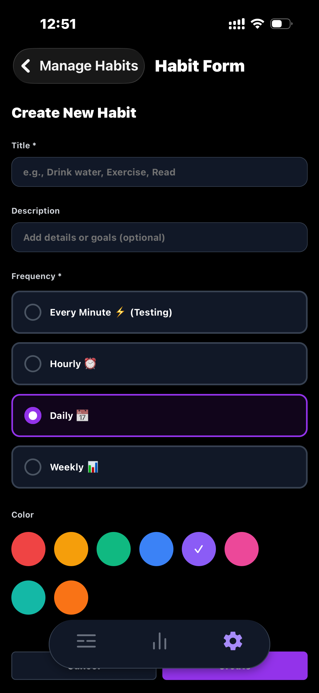
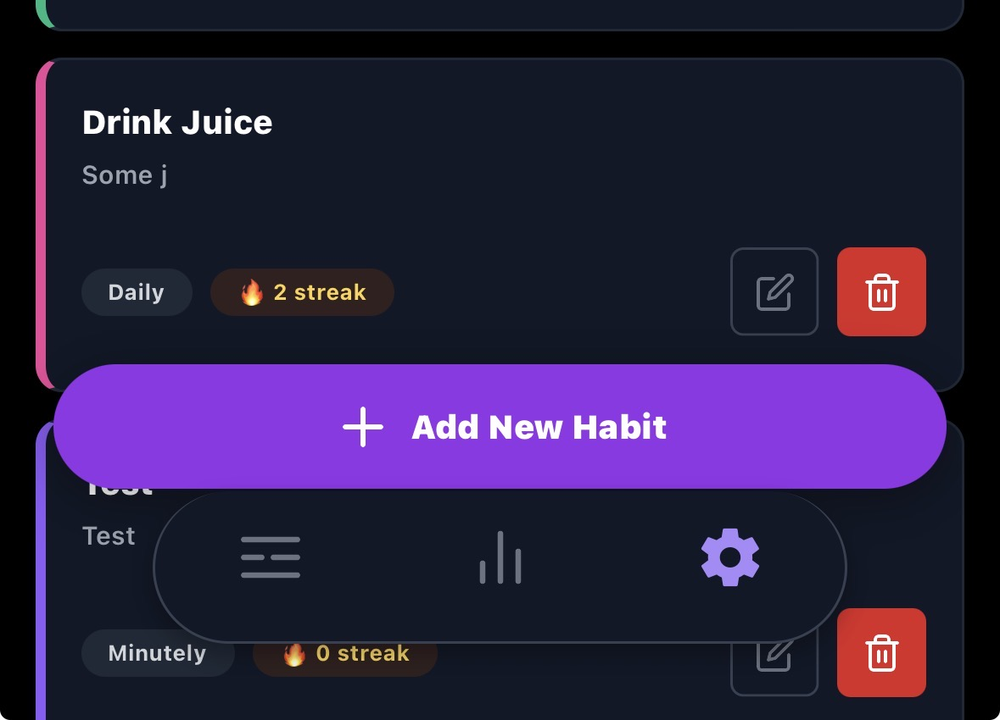

# Habit-App - Smart Habit Tracker

A modern, feature-rich mobile habit tracking application built with React Native and Expo. Habit-App helps users build and maintain positive habits through intelligent streak tracking, automatic resets, and real-time weather integration.

## Overview

Habit-App is a cross-platform mobile application that enables users to create, track, and manage their daily habits with ease. The app features a beautiful dark-themed UI, smart frequency-based habit resets, streak tracking with grace periods, and weather-aware habit planning through real-time API integration.

## Key Features

### Full CRUD Operations

- **Create Habits**: Add new habits with customizable titles, descriptions, frequencies, and color coding
- **Read Habits**: View all habits in an organized list with visual indicators for completion status
- **Update Habits**: Edit existing habit details including frequency and appearance
- **Delete Habits**: Remove habits with confirmation prompts to prevent accidental deletion

### Intelligent Streak Tracking

- **Automatic Streak Calculation**: Tracks consecutive completions based on habit frequency
- **Grace Period Logic**: Provides buffer time before resetting streaks (e.g., 2 hours for hourly habits, 1 day for daily habits)
- **Visual Streak Display**: Shows current streak count with fire indicators across all screens

### Smart Frequency-Based Resets

- **Multiple Frequency Options**:
  - **Minutely**: Resets after 60 seconds - ideal for testing
  - **Hourly**: Resets 60 minutes after completion
  - **Daily**: Resets at midnight (calendar-based)
  - **Weekly**: Resets at the start of each week
- **Duration-Based Logic**: Hourly and minutely habits reset based on elapsed time from completion
- **Calendar-Based Logic**: Daily and weekly habits reset at specific calendar boundaries
- **Real-Time Updates**: Habits automatically uncheck when their reset period expires (checks every second)
- **Background Sync**: Habits update when app returns to foreground via AppState listener

### Weather Integration

- **Real-Time Weather Data**: Fetches current weather for Maldives using Open-Meteo API
- **Offline Caching**: Stores last successful weather fetch in AsyncStorage for offline viewing
- **Visual Weather Display**: Shows temperature, conditions, wind speed, and location
- **Smart Loading**: Displays cached data immediately while fetching fresh data in background

### Comprehensive Statistics

- **Overview Metrics**: Total habits, completion rate, and active streaks
- **Frequency Grouping**: Habits organized by their frequency type
- **Detailed Habit Stats**: Individual streak counts and completion history
- **Visual Indicators**: Color-coded frequency badges and streak displays

### Offline Data Persistence

- **AsyncStorage Integration**: All habit data persists locally on device
- **Automatic Saving**: Changes sync to storage immediately
- **Fast Load Times**: Cached data loads instantly on app launch
- **No Internet Required**: Full functionality available offline (except weather updates)

### Modern UI/UX

- **Dark Theme**: Sleek black, purple, and white color scheme
- **Floating Navigation**: Rounded pill-style tab bar with smooth animations
- **Custom Radio Buttons**: Intuitive frequency selection without dropdown modals
- **Responsive Design**: Optimized layouts for various screen sizes
- **Visual Feedback**: Color-coded habit cards with completion states

## Technologies Used

### Core Framework

- **React Native**: Cross-platform mobile development
- **Expo SDK**: Development toolchain and native modules
- **Expo Router**: File-based navigation system
- **TypeScript**: Type-safe development

### Styling & UI

- **NativeWind**: Tailwind CSS for React Native
- **React Native SVG**: Custom icon components
- **Tailwind Variants**: Dynamic styling with variants

### State Management

- **React Context API**: Global state management via `HabitContext`
- **React Hooks**: useState, useEffect, useCallback for local state

### Data Persistence

- **AsyncStorage**: Local storage for habit data and weather cache
- **JSON Serialization**: Structured data storage

### External APIs

- **Open-Meteo API**: Free weather data service (no API key required)
- **Coordinates**: Malé, Maldives (4.1755°N, 73.5093°E)

### Development Tools

- **ESLint**: Code linting and formatting
- **Prettier**: Code formatting
- **Git**: Version control

## Installation & Setup

### Prerequisites

- Node.js (v16 or higher)
- npm or yarn
- Expo Go app (for testing on physical device)
- iOS Simulator or Android Emulator (optional)

### Installation Steps

1. **Clone the repository**

   ```bash
   git clone <repository-url>
   cd RN-ExpoGo-Villa-Sample
   ```

2. **Install dependencies**

   ```bash
   npm install
   ```

3. **Start the development server**

   ```bash
   npx expo start
   ```

4. **Run on device/emulator**
   - **iOS Simulator**: Press `i` in the terminal
   - **Android Emulator**: Press `a` in the terminal
   - **Physical Device**: Scan the QR code with Expo Go app

### Additional Commands

```bash
# Clear cache and restart
npx expo start -c

# Run on specific platform
npx expo start --ios
npx expo start --android

# Build for production
npx expo build:ios
npx expo build:android
```

## Screenshots

### Home Screen (Tracker)


_Main habit tracking interface with weather widget and today's habits_

### Statistics Screen


_Overview metrics and detailed habit statistics grouped by frequency_

### Manage Screen


_Full habit list with edit and delete options_

### Create/Edit Habit Form


_Habit creation and editing interface with frequency selection and color picker_

### Floating Navigation


_Modern floating pill-style tab navigation_

## Project Structure

```
src/
├── app/
│   ├── (app)/
│   │   ├── index.tsx          # Tracker screen (home)
│   │   ├── stats.tsx          # Statistics screen
│   │   ├── manage/
│   │   │   ├── _layout.tsx    # Manage stack layout
│   │   │   ├── index.tsx      # Habit list
│   │   │   └── form.tsx       # Create/Edit form
│   │   └── _layout.tsx        # Tab navigation
│   └── _layout.tsx            # Root layout
├── components/
│   ├── habit-item.tsx         # Habit card component
│   ├── weather-widget.tsx     # Weather display
│   └── ui/                    # Reusable UI components
├── context/
│   └── HabitContext.tsx       # Global habit state
└── stores/
    └── types.ts               # TypeScript interfaces
```

## Configuration

### Weather API

The app uses the Open-Meteo API for weather data. To change the location:

1. Open `src/components/weather-widget.tsx`
2. Update the coordinates in the API URL:
   ```typescript
   const response = await fetch(
     'https://api.open-meteo.com/v1/forecast?latitude=YOUR_LAT&longitude=YOUR_LONG&current_weather=true',
   );
   ```
3. Update the location name in the display text

### Habit Frequencies

To modify frequency options, edit `src/app/(app)/manage/form.tsx`:

```typescript
const frequencyOptions = [
  {value: 'minutely', label: 'Every Minute (Testing)'},
  {value: 'hourly', label: 'Hourly'},
  {value: 'daily', label: 'Daily'},
  {value: 'weekly', label: 'Weekly'},
];
```

## Usage Guide

### Creating a Habit

1. Navigate to the **Manage** tab
2. Tap the **"Add New Habit"** floating button
3. Fill in the habit details:
   - Title (required)
   - Description (optional)
   - Frequency (select one)
   - Color (choose from palette)
4. Tap **"Create"** to save

### Tracking Habits

1. Go to the **Tracker** tab
2. Tap on any habit card to mark it as complete
3. Tap again to unmark if needed
4. View your current streak on each card

### Viewing Statistics

1. Navigate to the **Stats** tab
2. View overall completion rate and active streaks
3. Scroll down to see habits grouped by frequency
4. Check individual habit streaks

### Editing/Deleting Habits

1. Go to the **Manage** tab
2. Find the habit you want to modify
3. Tap the **edit icon** to modify or **trash icon** to delete
4. Confirm deletion when prompted

## Known Issues & Future Improvements

### Known Issues

- **Weather API Rate Limiting**: Free tier has request limits; cached data used when limit reached
- **Streak Grace Period**: Grace period logic may need adjustment based on user timezone
- **Floating Navbar Overlap**: Some content may be hidden behind the floating navigation on smaller screens (mitigated with bottom padding)

### Planned Improvements

- **Notifications**: Push notifications for habit reminders
- **Custom Frequencies**: Allow users to define custom repeat intervals
- **Habit Categories**: Group habits by category (Health, Productivity, etc.)
- **Data Export**: Export habit data to CSV or JSON
- **Cloud Sync**: Backup and sync across devices
- **Habit Templates**: Pre-built habit templates for common goals
- **Dark/Light Mode Toggle**: User preference for theme
- **Habit History Calendar**: Visual calendar view of completion history
- **Achievements System**: Badges and milestones for streak achievements
- **Social Features**: Share progress with friends

## Development Reflection

### Challenges Encountered

1. **Text Rendering Errors**: Encountered "Text strings must be rendered within a <Text> component" errors due to complex View nesting and mixing inline styles with NativeWind classes. Resolved by flattening component structure and using consistent styling approaches.

2. **Floating Navigation Layout**: Implementing a floating pill-style navigation required careful positioning and padding adjustments to prevent content overlap across different screens.

3. **Frequency Reset Logic**: Designing a system that handles both duration-based (hourly, minutely) and calendar-based (daily, weekly) resets required careful timestamp comparison and AppState management.

4. **Real-Time Updates**: Implementing automatic habit resets without app reload required a combination of setInterval checks and AppState listeners for optimal performance.

### Key Learnings

- **Component Architecture**: Importance of flat, simple component structures to avoid React Native rendering issues
- **State Management**: Context API is sufficient for medium-complexity apps without needing Redux
- **Offline-First Design**: AsyncStorage caching significantly improves user experience
- **TypeScript Benefits**: Type safety caught numerous bugs during development
- **NativeWind Advantages**: Tailwind-style classes accelerate UI development significantly

### Success Metrics

- Full CRUD functionality implemented
- Offline data persistence working reliably
- Real-time habit resets functioning correctly
- Weather integration with offline fallback
- Modern, responsive UI with dark theme
- Type-safe codebase with minimal runtime errors

## License

This project is licensed under the MIT License - see the LICENSE file for details.

## Contributors

- Developer: Ahmed Maaiz Wajeeh
- Project Type: Mobile Application Development
- Framework: React Native (Expo)

## Acknowledgments

- **Open-Meteo**: Free weather API service
- **Expo Team**: Excellent development toolchain
- **NativeWind**: Tailwind CSS for React Native
- **React Native Community**: Extensive documentation and support

---

**Built with React Native and Expo**
